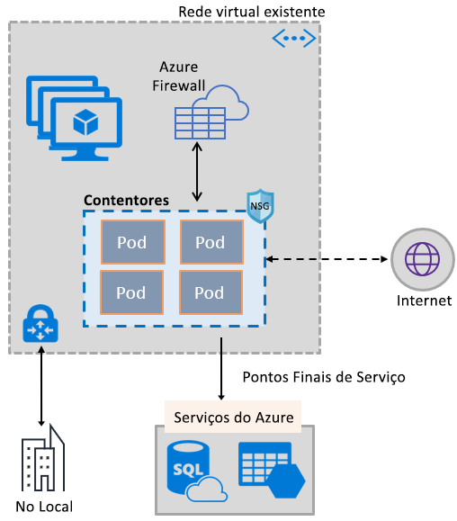

# Ativar contentores para utilizar as capacidades da Rede Virtual do Azure

Inclua o conjunto avançado de capacidades de rede do Azure em contentores, utilizando a mesma pilha de rede definida por software que capacita as máquinas virtuais. O plug-in da interface de rede de contentores (CNI) da Rede Virtual do Azure (CNI) é instalado numa Máquina Virtual do Azure. O plug-in atribui endereços IP de uma rede virtual a contentores colocados na máquina virtual, anexa-os à rede virtual e liga-os diretamente a outros contentores e recursos de rede virtual. O plug-in não depende de redes sobrepostas nem de rotas para a conectividade e fornece o mesmo desempenho das máquinas virtuais. Num nível elevado, o plug-in-fornece as seguintes capacidades:

- Um endereço IP de rede virtual é atribuído a cada Pod, que pode consistir num ou mais contentores.
- Os Pods podem ligar a redes virtuais em modo de peering e no local através do ExpressRoute ou uma rede de VPNs. Os Pods também são acessíveis a partir de redes em modo de peering e no local.
- Os Pods podem aceder a serviços como o Armazenamento do Azure e a Base de Dados SQL do Azure, que estão protegidos por pontos finais de serviço de rede virtual.
- Os grupos de segurança de rede e as rotas podem ser aplicados diretamente aos Pods.
- Os Pods podem ser colocados diretamente por trás de um Balanceador de Carga interno ou público do Azure, tal como nas máquinas virtuais
- Pode ser atribuído um endereço IP público aos Pods, tornando-os diretamente acessíveis a partir da Internet. Os Pods também podem aceder à Internet.
- Funciona perfeitamente com recursos do Kubernetes como os Serviços, controladores de entradas e o DNS do Kube. Um Serviço Kubernetes também pode ser exposto interna ou externamente através do Balanceador de Carga do Azure.

A imagem seguinte mostra como o plug-in fornece capacidades da Rede Virtual do Azure aos Pods:

O plug-in suporta plataformas Linux e Windows.

## Ligar Pods a uma rede virtual

Os Pods são colocados numa máquina virtual que faz parte de uma rede virtual. Um conjunto de endereços IP para os Pods é configurado como os endereços secundários na interface de rede de uma máquina virtual. O Azure CNI configura a conectividade de Rede básica dos Pods e gere a utilização dos endereços IP no conjunto. Quando um Pod é apresentado na máquina virtual, o Azure CNI atribui um endereço IP disponível no conjunto e liga o Pod a uma ponte de software na máquina virtual. Quando o Pod termina, o endereço IP é adicionado novamente ao conjunto. A imagem seguinte mostra como os Pods ligam a uma rede virtual:

## Acesso à Internet

Para permitir aos Pods aceder à Internet, o plug-in configura regras de *iptables* para a tradução de endereços de rede (NAT) do tráfego vinculado à Internet dos Pods. O endereço IP de origem do pacote é traduzido para o endereço IP primário na interface de rede da máquina virtual. As máquinas virtuais do Windows extraem automaticamente o tráfego do NAT de origem (SNAT) destinado aos endereços IP fora da sub-rede na qual está a máquina virtual. Normalmente, todo o tráfego destinado a um endereço IP fora do intervalo IP da rede virtual é traduzido.

## Limites

O plug-in suporta até 250 Pods por máquina virtual e até 16 000 Pods numa rede virtual. Estes limites são diferentes para o [Azure Kubernetes Service](../azure-resource-manager/management/azure-subscription-service-limits.md?toc=%2fazure%2fvirtual-network%2ftoc.json#azure-kubernetes-service-limits).

## Utilizar o plug-in

O plug-in pode ser utilizado das seguintes formas, para fornecer a ligação à rede virtual básica para Pods ou contentores de Docker:

- **Azure Kubernetes Service**: o plug-in está integrado no Azure Kubernetes Service (AKS) e pode ser utilizado ao escolher a opção *Redes Avançadas*. As Redes Avançadas permitem implementar um cluster do Kubernetes numa rede virtual existente ou nova. Para saber mais sobre as Redes Avançadas e os passos para configurá-las, veja [Configuração de redes no AKS](../aks/networking-overview.md?toc=%2fazure%2fvirtual-network%2ftoc.json).
- **AKS-Engine**: AKS-Engine é uma ferramenta que gera um modelo de Gestor de Recursos Azure para a implantação de um cluster Kubernetes em Azure. Para obter instruções detalhadas, consulte [implementar o plug-in para os clusters AKS-Engine Kubernetes](deploy-container-networking.md#deploy-the-azure-virtual-network-container-network-interface-plug-in).
- **Criar o seu próprio cluster Kubernetes em Azure**: O plug-in pode ser usado para fornecer networking básico para Pods em clusters Kubernetes que você próprio implanta, sem depender de AKS, ou ferramentas como o AKS-Engine. Neste caso, o plug-in é instalado e ativado em todas as máquinas virtuais num cluster. Para obter instruções detalhadas, veja [Implementar o plug-in para um cluster do Kubernetes que implementar por conta própria](deploy-container-networking.md#deploy-plug-in-for-a-kubernetes-cluster).
- **Ligação à rede virtual para contentores de Docker no Azure**: o plug-in pode ser utilizado quando não quer criar um cluster do Kubernetes e gostaria de criar contentores do Docker com ligação à rede virtual, em máquinas virtuais. Para obter instruções detalhadas, veja [Implementar o plug-in para o Docker](deploy-container-networking.md#deploy-plug-in-for-docker-containers).

## Passos seguintes

[Implementar o plug-in](deploy-container-networking.md) para clusters do Kubernetes ou contentores de Docker
