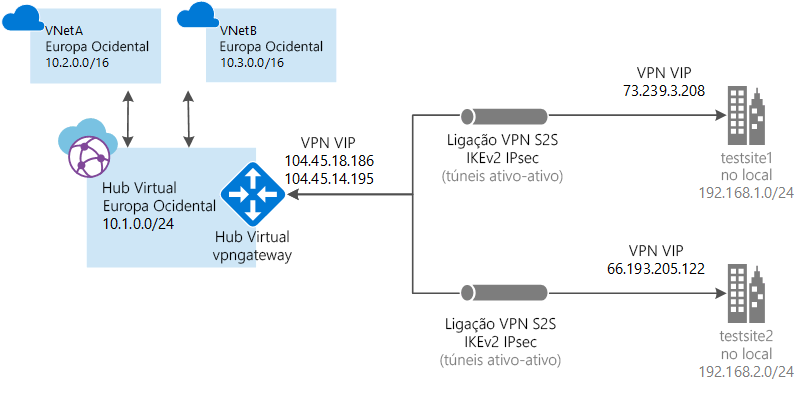

# O que é a WAN Virtual do Azure?

A WAN Virtual do Azure é um serviço de rede que fornece conectividade ramo a ramo otimizada e automatizada através do Azure. A WAN Virtual permite-lhe ligar e configurar dispositivos de ramo para comunicar com o Azure. Isso pode ser feito manualmente ou através de dispositivos de parceiros através de um parceiro de Virtual WAN. Utilizar dispositivos de parceiros, permite que a facilidade de uso, a simplificação da conectividade e gestão de configuração. Para obter mais informações, consulte a [localizações e parceiros](virtual-wan-locations-partners.md) artigo. Além disso, o dashboard incorporado do Azure WAN fornece informações instantâneas de resolução de problemas que podem ajudar a poupar tempo e dá-lhe uma forma fácil de ver a conectividade em grande escala.

Este artigo fornece uma vista rápida da conectividade de rede das suas cargas de trabalho pertencentes e não pertencentes ao Azure. A WAN Virtual oferece as seguintes vantagens:

* **Soluções de conectividade integrada no hub- and -spoke:** Automatize a configuração de Site a Site e a conectividade entre sites no local e um hub do Azure.
* **Instalação automatizada do spoke e configuração:** Ligar a redes virtuais e cargas de trabalho para o hub do Azure forma totalmente integrada.
* **Resolução de problemas intuitivo:** Pode ver o fluxo de ponto-a-ponto no Azure e utilize estas informações para tomar as medidas necessárias.

## Ligações Site a site

Para criar uma ligação Site a Site através da WAN Virtual, pode prosseguir através de um [parceiro de WAN Virtual](virtual-wan-locations-partners.md) ou criar a ligação manualmente.

### Fluxo de trabalho do parceiro

Quando trabalha com um parceiro de Virtual WAN, é o fluxo de trabalho:

1. O controlador de dispositivos de ramo (VPN/SDWAN) é autenticado para exportar informações centradas nos sites para o Azure com um [Principal de Serviço do Azure](../active-directory/develop/howto-create-service-principal-portal.md).
2. O controlador de dispositivos de ramo (VPN/SDWAN) obtém a configuração de conectividade do Azure e atualiza o dispositivo local. Isto automatiza a transferência de configuração, a edição e a atualização do dispositivo VPN no local.
3. Depois de o dispositivo ter a configuração certa do Azure, é estabelecida uma ligação site a site (dois túneis ativos) à WAN do Azure. O Azure suporta IKEv1 e IKEv2. O BGP é opcional.

Se não quiser usar um parceiro, pode configurar a ligação manualmente, consulte [criar uma ligação de Site a Site com Virtual WAN](virtual-wan-site-to-site-portal.md).

## Ligações Ponto a site (Pré-visualização)

Uma ligação Ponto a Site (P2S) permite-lhe criar uma ligação segura ao seu hub virtual a partir de um computador cliente individual. É estabelecida uma ligação P2S ao iniciá-la a partir do computador cliente. Esta solução é útil para as pessoas que trabalham à distância que queiram ligar a partir de uma localização remota, como, por exemplo, a partir de casa ou de uma conferência. Uma VPN P2S também é uma solução útil para utilizar em vez de uma VPN S2S, quando são poucos os clientes que precisam de ligar.

Para criar a ligação manualmente, veja [Criar uma ligação Ponto a Site com a WAN Virtual](virtual-wan-point-to-site-portal.md).

## Ligações do ExpressRoute (Pré-visualização)

Para criar a ligação manualmente, veja [Criar uma ligação ExpressRoute com a WAN Virtual](virtual-wan-expressroute-portal.md).

## Recursos da WAN virtual

Para configurar uma WAN virtual ponto a ponto, crie os seguintes recursos:

* **virtualWAN:** O recurso de virtualWAN representa uma sobreposição virtual da sua rede do Azure e é uma coleção de vários recursos. Contém ligações a todos os hubs virtuais que quer ter na WAN virtual. Os recursos da WAN virtual estão isolados uns dos outros e não podem conter um hub comum. Os Hubs Virtuais na WAN Virtual não comunicam entre si. A propriedade "Permitir tráfego de ramo para ramo" permite o tráfego entre os sites VPN, bem como Sites com o VPN para ExpressRoute ativado. Lembre-se de que o ExpressRoute na WAN Virtual do Azure está atualmente em Pré-visualização.

* **Site:** O recurso de site conhecido como vpnsite representa o dispositivo VPN no local e as respetivas definições. Ao trabalhar com um parceiro de WAN Virtual, tem uma solução integrada para exportar automaticamente estas informações para o Azure.

* **Hub:** Um hub virtual é uma rede virtual gerida pela Microsoft. O hub contém vários pontos finais de serviço para ativar a conectividade da rede no local (vpnsite). O hub é o núcleo da sua rede numa região. Só pode existir um hub por região do Azure. Quando cria um hub com o portal do Azure, este cria uma VNet e um vpngateway do hub virtual.

  Um gateway do hub não é igual a um gateway de rede virtual que utiliza para o ExpressRoute e o Gateway de VPN. Por exemplo, ao utilizar a WAN Virtual, não cria uma ligação Site a Site a partir do site no local diretamente à VNet. Em vez disso, cria uma ligação Site a Site ao hub. O tráfego passa sempre pelo gateway do hub. Isto significa que as VNets não precisam do seu próprio gateway de rede virtual. A WAN Virtual permite às VNets tirar partido do fácil dimensionamento através do hub virtual e do gateway do hub virtual. 

* **Ligação do hub de rede virtual:** O recurso de ligação de rede virtual de Hub é utilizado para ligar o hub de forma totalmente integrada à sua rede virtual. Neste momento, só pode ligar a redes virtuais que estejam na mesma região do hub.

* **Tabela de rotas de Hub:**  Pode criar uma rota de virtual hub e aplicam-se a rota à tabela de rotas de virtual hub. Pode aplicar várias rotas à tabela de rotas do hub virtual.

## Parceiros e localizações

### Parceiros

[!INCLUDE [partners](../../includes/virtual-wan-partners-include.md)]

### localizações

[!INCLUDE [regions](../../includes/virtual-wan-regions-include.md)]

## FAQ

[!INCLUDE [Virtual WAN FAQ](../../includes/virtual-wan-faq-include.md)]

## Passos Seguintes

Ver os [Virtual WAN parceiros e localizações de](virtual-wan-locations-partners.md) página.
