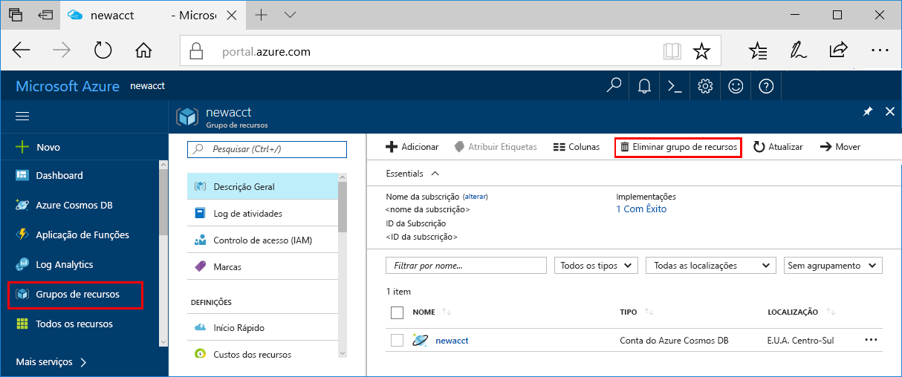

>[!IMPORTANT]
>Os recursos que criou podem ser usados como pré-requisitos para outros tutoriais de Aprendizagem automática Azure e artigos de como fazer. 

Se não planeia utilizar os recursos que criou, elimine-os para não incorrer em quaisquer encargos:

1. No portal do Azure, selecione **Grupos de recursos** na extremidade esquerda.
 
1. Na lista, selecione o grupo de recursos que criou.

1. Selecione **Eliminar grupo de recursos**.

   

1. Introduza o nome do grupo de recursos. Em seguida, selecione **Eliminar**.
