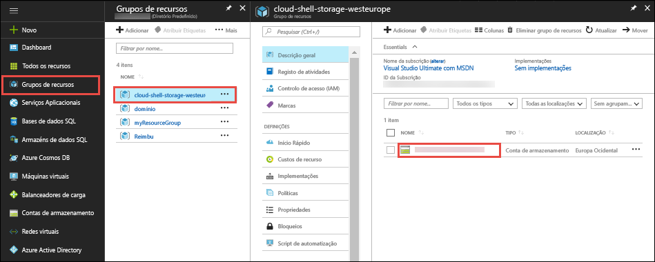
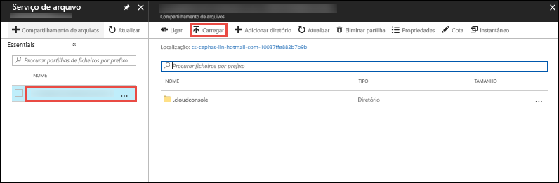

Na [portal do Azure](https://portal.azure.com), clique em **grupos de recursos** > **cloud-shell-storage -\<your_region >**  >   **\<storage_account_name >**.



Na **descrição geral** página da conta de armazenamento, selecione **ficheiros**.

Selecione a partilha de ficheiros geradas automaticamente e selecione **carregar**. Esta partilha de ficheiros está montada no Cloud Shell como `clouddrive`.



Clique o Seletor de ficheiro e selecione o ficheiro ZIP, em seguida, clique em **carregar**. 

No Cloud Shell, utilize `ls` para verificar se pode ver o ficheiro ZIP carregado predefinida `clouddrive` partilhar.

```azurecli-interactive
ls clouddrive
```
