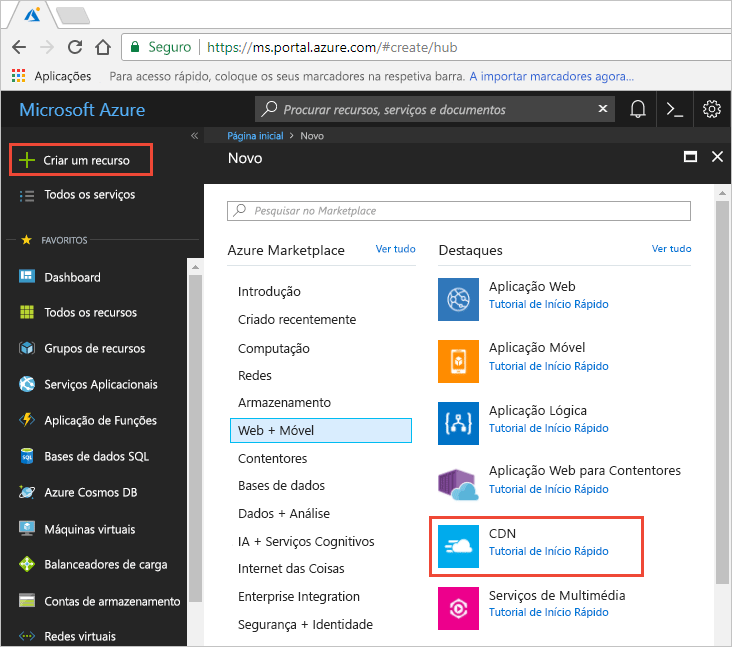
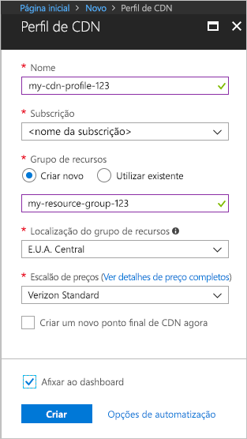

## Criar um novo perfil da CDN

Um perfil da CDN é um contentor de pontos finais da CDN e especifica um escalão de preço.

1. No portal Azure, selecione **Criar um recurso** (na parte superior esquerda). O painel **Novo** é apresentado.
   
1. Procure e selecione **CDN,** em seguida, **selecione Criar**:
   
    

    Aparece o painel de **perfil cdn.**

1. Introduza os seguintes valores:
   
    | Definição  | Valor |
    | -------- | ----- |
    | **Nome** | *Insira o perfil do CDN-123* para o seu nome de perfil. Este nome deve ser globalmente único; se já estiver em uso, insira um nome diferente. |
    | **Subscrição** | Selecione uma subscrição do Azure na lista pendente. |
    | **Grupo de recursos** | Selecione **Criar novo** e introduza *CDNQuickstart-rg* para o nome do seu grupo de recursos, ou selecione **Use existente** e escolha *CDNQuickstart-rg* se já tiver o grupo. | 
    | **Localização do grupo de recursos** | Selecione uma localização perto de si na lista de drop-down. |
    | **Escalão de preço** | Selecione uma opção **Standard Akamai** da lista de drop-down. (O tempo de implantação para o nível Akamai é de cerca de um minuto. O nível da Microsoft demora cerca de 10 minutos e os níveis de Verizon demoram cerca de 30 minutos.) |
    | **Agora, crie um novo ponto final da CDN** | Deixe por selecionar. |  
   
    

1. Selecione **Criar** para criar o perfil.

