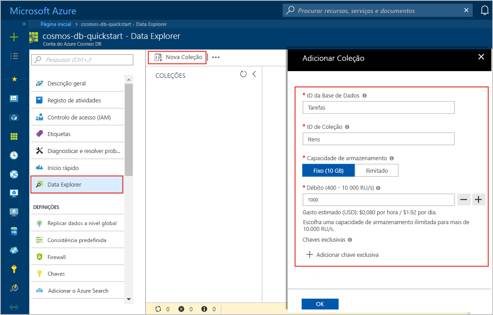

Agora, pode utilizar a ferramenta Data Explorer no portal do Azure para criar uma base de dados e um contentor. 

1. Selecione **o Data Explorer** > **novo contentor**. 
    
    O **adicionar contentor** área é apresentada na extremidade direita, poderá ter de se deslocar para a direita para vê-lo.

    

2. Na **adicionar contentor** página, introduza as definições para o novo contentor.

    |Definição|Valor sugerido|Descrição
    |---|---|---|
    |**ID da Base de Dados**|Tarefas|Introduza *ToDoList* como o nome para a nova base de dados. Nomes de base de dados tem de conter entre 1 e 255 carateres e não podem conter `/, \\, #, ?`, ou um espaço à direita. Verifique os **débito de base de dados de aprovisionamento** opção, permite-lhe partilhar o débito aprovisionado para a base de dados em todos os contentores na base de dados. Esta opção também ajuda a com redução de custos. |
    |**Débito**|400|Deixe o débito com 400 unidades de pedido por segundo (RU/s). Se pretender reduzir a latência, pode aumentar o débito mais tarde.| 
    |**ID de contentor**|Itens|Introduza *itens* como o nome para o novo contentor. IDs de contentor têm os mesmos requisitos como nomes de base de dados.|
    |**Chave de partição**| /categoria| O exemplo descrito neste artigo usa */category* como a chave de partição.|
    
    Além das configurações anteriores, pode adicionar opcionalmente **chaves exclusivas** do contentor. Vamos deixar o campo vazio neste exemplo. As chaves exclusivas oferecem aos programadores a capacidade de adicionar uma camada de integridade dos dados na base de dados. Ao criar uma política de chaves exclusivas durante a criação de um contentor, garantir a exclusividade de um ou mais valores por chave de partição. Para saber mais, consulte o artigo [Chaves exclusivas no Azure Cosmos DB](../articles/cosmos-db/unique-keys.md).
    
    Selecione **OK**. O Data Explorer mostra a nova base de dados e o contentor.