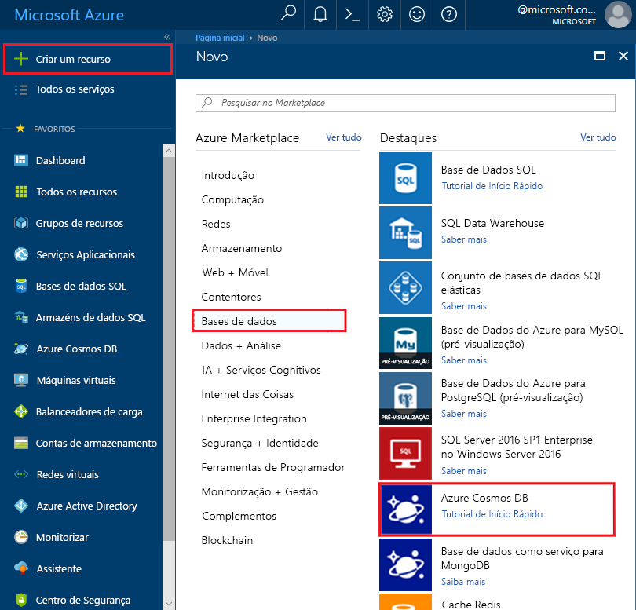

1. Numa nova janela do browser, inicie sessão no [portal do Azure](https://portal.azure.com/).

2. Selecione **Criar um recurso** > **Bases de dados** > **Azure Cosmos DB**.
   
   

3. Na **criar o Azure Cosmos DB conta** página, introduza as definições para a nova conta do Azure Cosmos DB. 
 
    Definição|Valor|Descrição
    ---|---|---
    Subscrição|A sua subscrição|Selecione a subscrição do Azure que quer utilizar para esta conta do Azure Cosmos DB. 
    Grupo de Recursos|Criar novo  Em seguida, introduza o mesmo nome exclusivo, conforme indicado na ID|Selecione **Criar novo**. Em seguida, introduza um nome de grupo de recursos novo para a sua conta. Para manter a simplicidade, utilize o mesmo nome do ID. 
    Nome da Conta|Introduza um nome exclusivo|Introduza um nome exclusivo para identificar a sua conta do Azure Cosmos DB. Uma vez que *documents.azure.com* é anexado ao ID que indicar para criar o seu URI, utilize um ID exclusivo.  O ID pode utilizar apenas letras minúsculas, números e o caráter de hífen (-). Tem de ter entre 3 a 31 carateres de comprimento.
    API|Cassandra|A API determina o tipo de conta a criar. O Azure Cosmos DB oferece cinco APIs: Core(SQL) bases de dados do documento, Gremlin para bases de dados do gráfico, o MongoDB para bases de dados de documentos, tabelas do Azure e Cassandra. Atualmente, tem de criar uma conta separada para cada API.   Selecione **Cassandra** porque neste início rápido está a criar uma tabela que funciona com a API de Cassandra.   [Saiba mais sobre a API para Cassandra](../articles/cosmos-db/cassandra-introduction.md).|
    Location|Selecione a região mais próxima dos seus utilizadores|Selecione a localização geográfica para alojar a sua conta do Azure Cosmos DB. Utilize a localização mais próxima dos seus utilizadores para lhes dar o acesso mais rápido aos dados.

    Selecione **rever + criar**. Pode ignorar o **rede** e **etiquetas** secção. 

    

4. A criação da conta demora alguns minutos. Aguarde até que o portal apresente a página com a mensagem **Parabéns! A sua conta do Azure Cosmos DB foi criada**.

