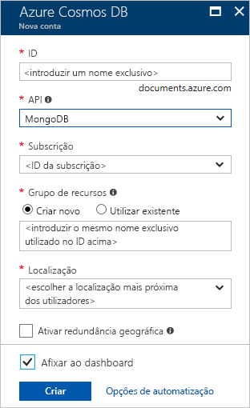

1. Numa nova janela do browser, inicie sessão no [portal do Azure](https://portal.azure.com/).

2. No menu esquerdo, **selecione Criar um recurso.**
   
   
   
3. Na página **Nova,** selecione **Databases**  >  **Azure Cosmos DB**.
   
   
   
3. Na página **De Conta DB Create Azure Cosmos,** insira as definições para a nova conta DB da Azure Cosmos. 
 
    Definição|Valor|Descrição
    ---|---|---
    Subscrição|A sua subscrição|Selecione a subscrição do Azure que quer utilizar para esta conta do Azure Cosmos DB. 
    Grupo de Recursos|Criar novo  Em seguida, insira o mesmo nome que Nome de Conta|Selecione **Criar novo**. Em seguida, insira um novo nome de grupo de recursos para a sua conta. Para simplificar, use o mesmo nome que o nome da sua conta DB Azure Cosmos. 
    Nome da Conta|Introduza um nome exclusivo|Introduza um nome exclusivo para identificar a sua conta do Azure Cosmos DB. A sua conta URI será *mongo.cosmos.azure.com* anexada ao seu nome de conta único.  O nome da conta só pode usar letras minúsculas, números e hífens (-), e deve ter entre 3 e 31 caracteres de comprimento.
    API|Azure Cosmos DB para Mongo DB API|A API determina o tipo de conta a criar. A Azure Cosmos DB fornece cinco APIs: Core (SQL) para bases de dados de documentos, Gremlin para bases de dados de gráficos, Azure Cosmos DB para Mongo DB API para bases de dados de documentos, Tabela Azure e Cassandra. De momento, deve criar uma conta separada para cada API.   Selecione **Azure Cosmos DB para Mongo DB API**  porque neste quickstart você está criando uma coleção que funciona com o MongoDB.  [Saiba mais sobre a Azure Cosmos DB para a MongoDB API](../articles/cosmos-db/mongodb-introduction.md).|
    Localização|Selecione a região mais próxima dos seus utilizadores|Selecione a localização geográfica para alojar a sua conta do Azure Cosmos DB. Utilize a localização mais próxima dos seus utilizadores para lhes dar o acesso mais rápido aos dados.|
    Modo de capacidade|Produção provisida ou sem servidor|**Selecione Provisão para** criar uma conta no modo [de produção previsto.](../articles/cosmos-db/set-throughput.md) Selecione **Serverless** para criar uma conta no modo [sem servidor.](../articles/cosmos-db/serverless.md)  **Nota:** Apenas a versão 3.6 da API de MongoDB é suportada por contas sem servidor. Escolher 3.2 como a versão forçará a conta no modo de produção previsto.

    Selecione **Review+Create**. Pode saltar a secção **'Rede** e **Etiquetas'.** 

    

4. A criação da conta demora alguns minutos. Espere que o portal exiba os **Parabéns! A sua conta Azure Cosmos DB para a API da Mongo DB está pronta.**

    
