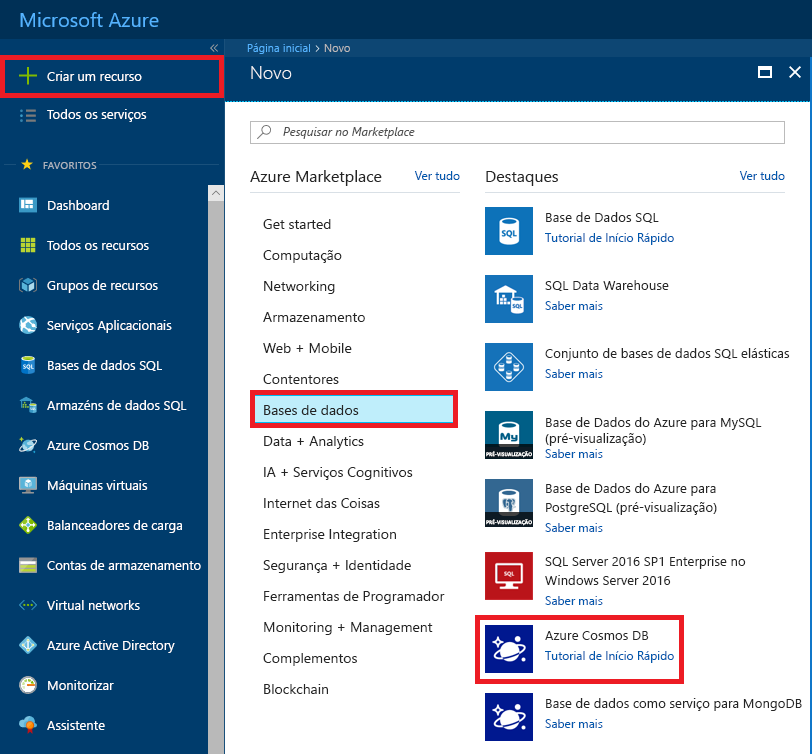

1. Numa nova janela, inicie sessão no [portal do Azure](https://portal.azure.com/).
2. No menu à esquerda, selecione **criar um recurso**, selecione **bancos de dados**e, em **Azure Cosmos DB**, selecione **criar**.
   
   

3. Na **criar o Azure Cosmos DB conta** página, introduza as definições para a nova conta do Azure Cosmos DB. 
 
    Definição|Valor|Descrição
    ---|---|---
    Subscrição|A sua subscrição|Selecione a subscrição do Azure que quer utilizar para esta conta do Azure Cosmos DB. 
    Grupo de Recursos|Criar novo  Em seguida, introduza o mesmo nome exclusivo, conforme indicado na ID|Selecione **Criar novo**. Em seguida, introduza um nome de grupo de recursos novo para a sua conta. Para manter a simplicidade, utilize o mesmo nome do ID. 
    Nome da Conta|Introduza um nome exclusivo|Introduza um nome exclusivo para identificar a sua conta do Azure Cosmos DB. Uma vez que *documents.azure.com* é anexado ao ID que indicar para criar o seu URI, utilize um ID exclusivo.  O ID pode utilizar apenas letras minúsculas, números e o caráter de hífen (-). Ele deve ter entre 3 e 31 caracteres de comprimento.
    API|API do Azure Cosmos DB para MongoDB|A API determina o tipo de conta a criar. O Azure Cosmos DB fornece cinco APIs: Core (SQL) para bancos de dados de documentos, Gremlin para bancos de dados de grafo, o MongoDB de API Azure Cosmos DB para bancos de dados de documentos, tabela do Azure e Cassandra. Atualmente, tem de criar uma conta separada para cada API.   Selecione **MongoDB** porque neste guia de início rápido você está criando uma tabela que funciona com o MongoDB.|
    Localização|Selecione a região mais próxima dos seus utilizadores|Selecione a localização geográfica para alojar a sua conta do Azure Cosmos DB. Utilize a localização mais próxima dos seus utilizadores para lhes dar o acesso mais rápido aos dados.

    Selecione **rever + criar**. Pode ignorar o **rede** e **etiquetas** secção. 

    

4. A criação da conta demora alguns minutos. Aguarde até que o portal exiba o **Parabéns! A página sua conta do cosmos com a compatibilidade de protocolo de conexão para MongoDB está pronta** .

    
