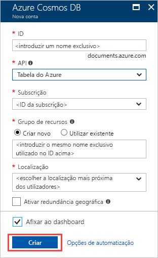

1. Numa nova janela do browser, inicie sessão no [portal do Azure](https://portal.azure.com/).
2. No menu à esquerda, clique em **criar um recurso**, clique em **bases de dados**e, em seguida, selecione **do Azure Cosmos DB**. 

3. Na **criar o Azure Cosmos DB conta** página, introduza as definições para a nova conta do Azure Cosmos DB. 
 
    Definição|Valor|Descrição
    ---|---|---
    Subscrição|A sua subscrição|Selecione a subscrição do Azure que quer utilizar para esta conta do Azure Cosmos DB. 
    Grupo de Recursos|Criar novo  Em seguida, introduza o mesmo nome exclusivo, conforme indicado na ID|Selecione **Criar novo**. Em seguida, introduza um nome de grupo de recursos novo para a sua conta. Para manter a simplicidade, utilize o mesmo nome do ID. 
    Nome da Conta|Introduza um nome exclusivo|Introduza um nome exclusivo para identificar a sua conta do Azure Cosmos DB.  O ID pode utilizar apenas letras minúsculas, números e o caráter de hífen (-). Tem de ter entre 3 a 31 carateres de comprimento.
    API|Tabela do Azure|A API determina o tipo de conta a criar. O Azure Cosmos DB oferece cinco APIs: Core(SQL) bases de dados do documento, Gremlin para bases de dados do gráfico, o MongoDB para bases de dados de documentos, tabelas do Azure e Cassandra. Atualmente, tem de criar uma conta separada para cada API.   Selecione **Tabela do Azure** porque neste início rápido está a criar uma tabela que funciona com a API da Tabela.   [Saber mais sobre a API da Tabela](../articles/cosmos-db/table-introduction.md)|
    Localização|Selecione a região mais próxima dos seus utilizadores|Selecione a localização geográfica para alojar a sua conta do Azure Cosmos DB. Utilize a localização mais próxima dos seus utilizadores para lhes dar o acesso mais rápido aos dados.

4. Pode deixar **Georredundância** e **escreve de várias regiões** opções para os valores predefinidos, que é **desativar** para evitar custos adicionais de RU. Pode ignorar o **rede** e **etiquetas**.

5. Selecione **rever + criar** depois de concluída a validação, selecione **criar** para criar a conta. 
 
   

6. A criação da conta demora alguns minutos e verá **sua implementação está em curso** mensagem. Aguarde pela mesma e, em seguida, selecione **Ir para recurso**.

    
