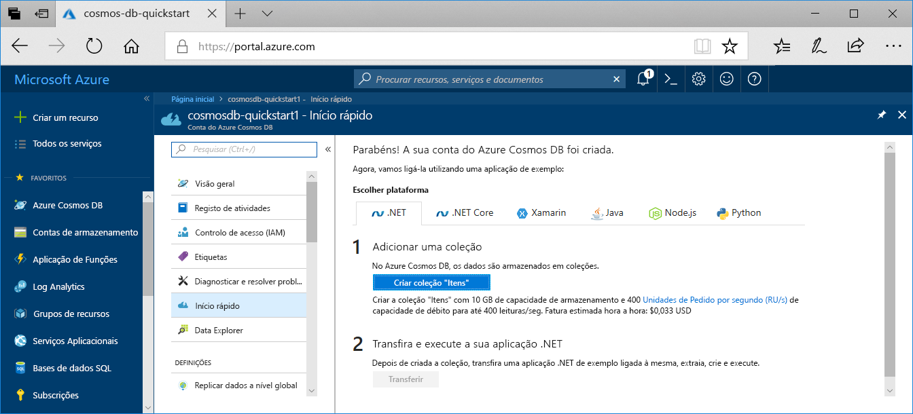

1. Inicie sessão no [portal do Azure](https://portal.azure.com/).
1. Selecione **Criar um recurso** > **Bases de dados** > **Azure Cosmos DB**.

   

1. Na página **criar conta de Azure Cosmos DB** , insira as configurações básicas para a nova conta do Azure Cosmos. 

    |Definição|Valor|Descrição |
    |---|---|---|
    |Subscription|Nome da subscrição|Selecione a assinatura do Azure que você deseja usar para esta conta do Azure Cosmos. |
    |Grupo de Recursos|Nome do grupo de recursos|Selecione um grupo de recursos ou selecione **criar novo**e insira um nome exclusivo para o novo grupo de recursos. |
    |Nome da Conta|Um nome exclusivo|Insira um nome para identificar sua conta do Azure Cosmos. Uma vez que *documents.azure.com* é anexado ao ID que indicar para criar o seu URI, utilize um ID exclusivo.  A ID só pode conter letras minúsculas, números e o caractere de hífen (-). Deve ter entre 3-31 caracteres de comprimento.|
    |API|O tipo de conta a ser criada|Selecione **núcleo (SQL)** para criar um banco de dados de documento e uma consulta usando a sintaxe SQL.   A API determina o tipo de conta a criar. O Azure Cosmos DB fornece cinco APIs: Core (SQL) e MongoDB para dados de documento, Gremlin para dados de grafo, tabela do Azure e Cassandra. Atualmente, tem de criar uma conta separada para cada API.   [Saiba mais sobre a API de SQL](../articles/cosmos-db/documentdb-introduction.md).|
    |Location|A região mais próxima dos seus utilizadores|Selecione a localização geográfica para alojar a sua conta do Azure Cosmos DB. Use o local mais próximo de seus usuários para dar a eles o acesso mais rápido aos dados.|

   

1. Selecione **Rever + criar**. Você pode ignorar as seções de **rede** e **marcas** .

1. Examine as configurações da conta e, em seguida, selecione **criar**. Leva alguns minutos para criar a conta. Aguarde até que a página do portal exiba **sua implantação esteja concluída**. 

    

1. Selecione **ir para o recurso** para acessar a página da conta Azure Cosmos DB. 

    
