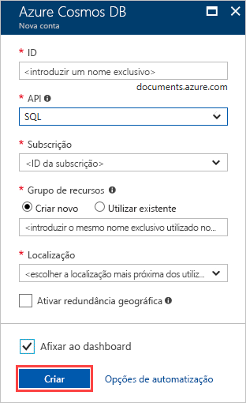

1. Inicie sessão no [portal do Azure](https://portal.azure.com/).
1. Selecione **Criar um recurso** > **Bases de dados** > **Azure Cosmos DB**.
   
   

1. Sobre o **criar o Azure Cosmos DB conta** página, introduza as definições básicas para a nova conta do Cosmos do Azure. 
 
    |Definição|Valor|Descrição |
    |---|---|---|
    |Subscrição|Nome da subscrição|Selecione a subscrição do Azure que pretende utilizar para esta conta do Cosmos do Azure. |
    |Grupo de Recursos|Nome do grupo de recursos|Selecione um grupo de recursos ou selecione **criar novo**, em seguida, introduza um nome exclusivo para o novo grupo de recursos. |
    | Nome da Conta|Introduza um nome exclusivo|Introduza um nome para identificar a sua conta do Cosmos do Azure. Uma vez que *documents.azure.com* é anexado ao ID que indicar para criar o seu URI, utilize um ID exclusivo.  O ID pode conter apenas letras minúsculas, números e o caráter de hífen (-). Tem de ter entre 3-31 carateres de comprimento.|
    | API|Núcleo (SQL)|A API determina o tipo de conta a criar. O Azure Cosmos DB oferece cinco APIs: Principal (SQL) e o MongoDB para dados de documentos, Gremlin para dados de gráficos, tabelas do Azure e Cassandra. Atualmente, tem de criar uma conta separada para cada API.   Selecione **Core (SQL)** para criar uma base de dados do documento e a consulta utilizando sintaxe SQL.   [Saiba mais sobre a API de SQL](../articles/cosmos-db/documentdb-introduction.md).|
    | Localização|Selecione a região mais próxima dos seus utilizadores|Selecione a localização geográfica para alojar a sua conta do Azure Cosmos DB. Utilize a localização mais próxima dos seus utilizadores para lhes dar o acesso mais rápido aos dados.|
   
   

1. Selecione **Rever + criar**. Pode ignorar o **rede** e **etiquetas** secções. 

1. Reveja as definições de conta e, em seguida, selecione **criar**. Demora alguns minutos para criar a conta. Aguarde até a página do portal exibir **sua implementação está completa**. 

    

1. Selecione **Ir para recurso** para ir para a página de conta do Azure Cosmos DB. 

    
