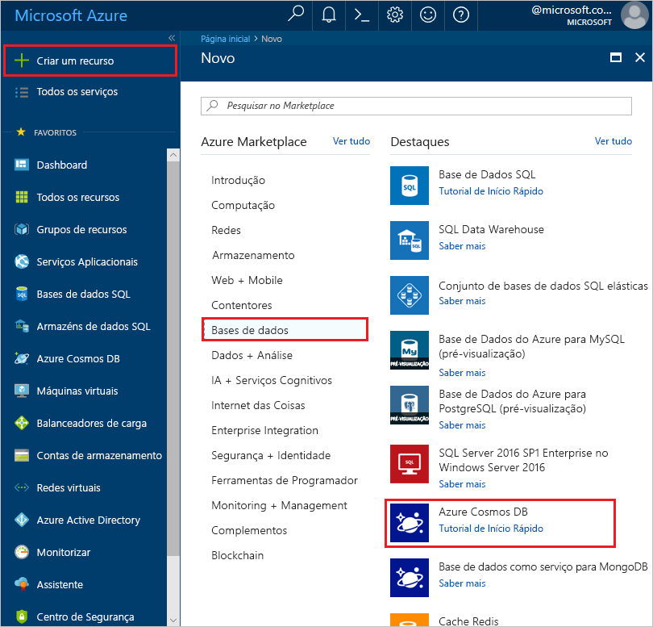

1. Aceda ao [portal do Azure](https://portal.azure.com/) para criar um conta do Azure Cosmos DB. Procure e selecione **Azure Cosmos DB**.

   

1. Selecione **Adicionar**.
1. Na página **Criar Conta do Azure Cosmos DB**, introduza as definições básicas da nova conta do Azure Cosmos DB. 

    |Definição|Valor|Descrição |
    |---|---|---|
    |Subscrição|Nome da subscrição|Selecione a subscrição do Azure que quer utilizar para esta conta do Azure Cosmos. |
    |Grupo de Recursos|Nome do grupo de recursos|Selecione um grupo de recursos ou selecione **Criar novo** e, em seguida, introduza um nome exclusivo para o novo grupo de recursos. |
    |Nome da Conta|Um nome exclusivo|Introduza um nome para identificar a conta do Azure Cosmos. Uma vez que *documents.azure.com* é anexado ao nome que indicar para criar o URI, utilize um nome exclusivo.  O nome só pode conter letras minúsculas, números e o caráter de hífen (-). Tem de ter entre 3 e 31 carateres.|
    |API|O tipo de conta a criar|Selecione **Núcleo (SQL)** para criar uma base de dados de documentos e consultar com a sintaxe SQL.   A API determina o tipo de conta a criar. A Azure Cosmos DB fornece cinco APIs: Core (SQL) e MongoDB para dados de documentos, Gremlin para dados de gráficos, Tabela Azure e Cassandra. De momento, deve criar uma conta separada para cada API.   [Saiba mais sobre a API SQL](../articles/cosmos-db/documentdb-introduction.md).|
    |Aplicar Desconto de Nível Livre|Aplicar ou não me candidatar|Com o nível gratuito Azure Cosmos DB, você receberá gratuitamente os primeiros 400 RU/s e 5 GB de armazenamento numa conta. Saiba mais sobre [o nível livre.](https://azure.microsoft.com/pricing/details/cosmos-db/)|
    |Localização|A região mais próxima dos seus utilizadores|Selecione a localização geográfica para alojar a sua conta do Azure Cosmos DB. Utilize a localização mais próxima dos utilizadores para lhes dar o acesso mais rápido aos dados.|
    |Tipo de conta|Produção ou Não Produção|Selecione **Produção** se a conta for utilizada para uma carga de trabalho de produção. Selecione **Não Produção** se a conta for utilizada para a não produção, por exemplo, desenvolvimento, teste, QA ou encenação. Trata-se de uma definição de etiqueta de recurso Azure que afina a experiência do Portal, mas não afeta a conta DB do Azure Cosmos subjacente. Pode alterar este valor a qualquer momento.|

> [!NOTE]
> Pode ter até um nível gratuito de conta Azure Cosmos DB por subscrição azure e deve optar por entrar na criação da conta. Se não vir a opção de aplicar o desconto de nível livre, isto significa que outra conta na subscrição já foi ativada com nível livre.
   
   

1. Selecione **Rever + criar**. Pode ignorar as secções **Rede** e **Etiquetas**.

1. Reveja as definições da conta e, em seguida, selecione **Criar**. A criação da conta demora alguns minutos. Aguarde até que a página do portal apresente **A implementação está concluída**. 

    

1. Selecione **Ir para recurso** para aceder à página da conta do Azure Cosmos DB. 

    
