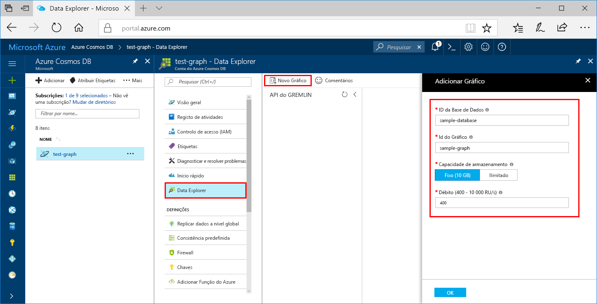

Agora, pode utilizar a ferramenta Data Explorer no portal do Azure para criar uma base de dados de gráfico. 

1. Clique em **Data Explorer** > **Novo Gráfico**.

    A área **Adicionar Gráfico** é apresentada na extremidade direita, pelo que poderá ter de se deslocar para a direita para vê-la.

    

2. Na página **Adicionar gráfico**, introduza as definições para o novo gráfico.

    Definição|Valor sugerido|Descrição
    ---|---|---
    ID da base de dados|base de dados de exemplo|Designe a nova base de dados como *sample-database*. Os nomes das bases de dados têm de ter entre um e 255 carateres e não podem conter `/ \ # ?` nem espaços à direita.
    ID do Graph|gráfico de exemplo|Denomine a nova coleção como *sample-graph*. Os nomes dos gráficos têm os mesmos requisitos de carateres que os IDs das bases de dados.
    Capacidade de Armazenamento|Fixa (10 GB)|Deixe o valor predefinido de **Fixa (10 GB)**. Este valor é a capacidade de armazenamento da base de dados.
    Débito|400 RUs|Altere o débito para 400 unidades de pedido por segundo (RU/s). Se pretender reduzir a latência, pode aumentar o débito mais tarde.

3. Assim que o formulário estiver preenchido, clique em **OK**.
