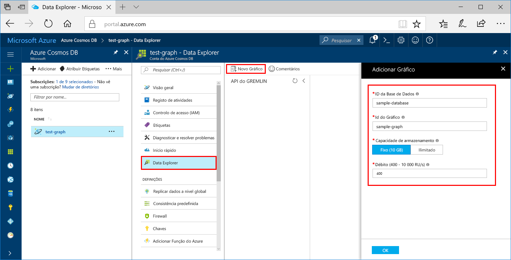

Agora, pode utilizar a ferramenta Data Explorer no portal do Azure para criar uma base de dados de gráfico. 

1. Selecione **data explorer**  >  **novo gráfico**.

    A área **Adicionar Gráfico** é apresentada na extremidade direita, pelo que poderá ter de se deslocar para a direita para vê-la.

    

2. Na página **Adicionar gráfico**, introduza as definições para o novo gráfico.

    Definição|Valor sugerido|Descrição
    ---|---|---
    ID da base de dados|base de dados de exemplo|Dê o nome *sample-database* à nova base de dados. Os nomes das bases de dados têm de ter entre um e 255 carateres e não podem conter `/ \ # ?` nem espaços à direita.
    Débito|400 RUs|Altere o débito para 400 unidades de pedido por segundo (RU/s). Se pretender reduzir a latência, pode aumentar verticalmente o débito mais tarde.
    ID do Graph|gráfico de exemplo|Dê o nome *sample-graph* à nova coleção. Os nomes dos gráficos têm os mesmos requisitos de carateres que os IDs das bases de dados.
    Chave de Partição| /pk |Todas as contas da Cosmos DB precisam de uma chave de partição para a escala horizontal. Saiba como selecionar uma chave de partição apropriada no [artigo de partição de dados gráficos](../articles/cosmos-db/graph-partitioning.md).

3. Uma vez preenchido o formulário, selecione **OK**.