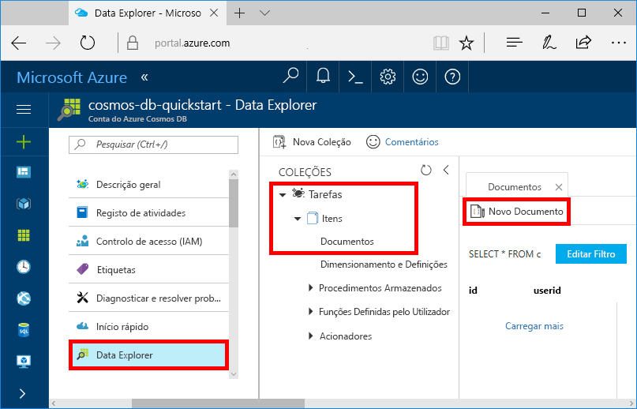
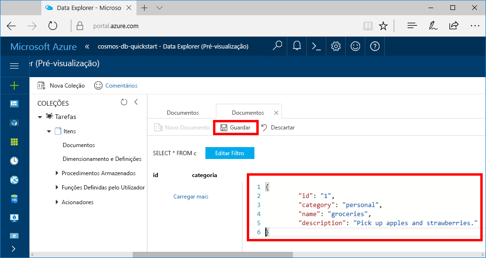

Agora pode adicionar dados ao seu novo recipiente utilizando o Data Explorer.

1. A partir do **Data Explorer,** expanda a base de **dados Tarefas,** expanda o recipiente **Itens.** Selecione **Itens** e, em seguida, selecione **Novo Item**.

   
  
2. Adicione agora um documento ao recipiente com a seguinte estrutura.

     ```json
     {
         "id": "1",
         "category": "personal",
         "name": "groceries",
         "description": "Pick up apples and strawberries.",
         "isComplete": false
     }
     ```

3. Depois de ter adicionado o json ao **separador Documentos,** **selecione Save**.

    

4.  Crie e guarde mais um documento onde insere um valor exclusivo para a propriedade `id` e altere as outras propriedades conforme necessário. Agora, os documentos podem ter qualquer estrutura que queira criar, uma vez que o Azure Cosmos DB não impõe qualquer esquema aos seus dados.