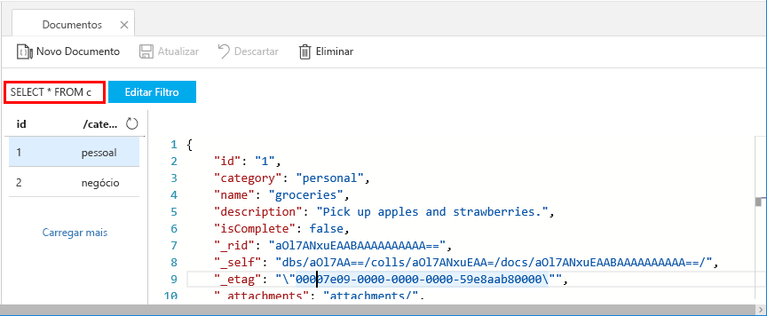

Pode utilizar consultas no Data Explorer para obter e filtrar os seus dados.

1. Na parte superior a **documentos** separador no Data Explorer, reveja a consulta predefinida `SELECT * FROM c`. Esta consulta obtém e apresenta todos os documentos na coleção na ordem de ID. 
   
   
   
1. Para alterar a consulta, selecione **Editar filtro**, substitua a consulta predefinida com `ORDER BY c._ts DESC`e, em seguida, selecione **aplicar filtro**.
   
   

   O apresenta consulta modificado os documentos por ordem, com base no respetivo carimbo de hora, portanto, agora o segundo documento descendente é listada em primeiro lugar. 
   
   

Se estiver familiarizado com a sintaxe SQL, pode introduzir qualquer suportado [consultas SQL](../articles/cosmos-db/sql-api-sql-query.md) na caixa de predicado de consulta. Também pode utilizar o Data Explorer para criar procedimentos armazenados, UDFs e acionadores para lógica de negócio do lado do servidor. 

O Data Explorer proporciona acesso fácil de portal do Azure para todos os recursos de acesso a dados programáticos incorporados disponíveis nas APIs. Também utilizar o portal para dimensionar o débito, obter chaves e cadeias de ligação e reveja as métricas e SLAs para a sua conta do Azure Cosmos DB. 

