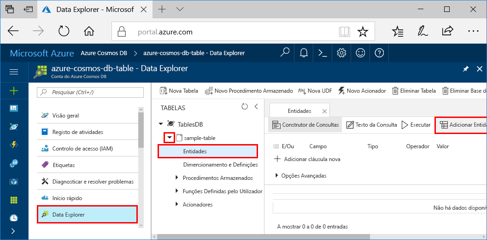
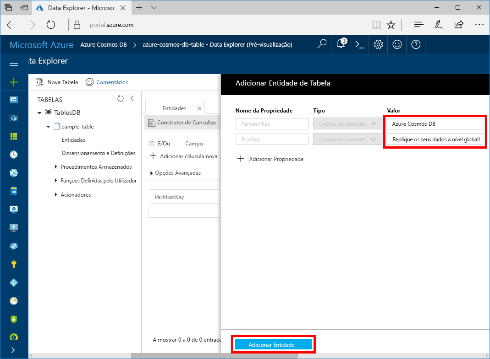

Pode agora utilizar o Data Explorer para adicionar dados à sua tabela nova.

1. No Data Explorer, expanda **sample-table**, clique em **Entidades** e, em seguida, clique em **Adicionar Entidade**.

   

2. Agora, adicione dados às caixas de valores PartitionKey e RowKey e clique em **Adicionar Entidade**.

   
  
    Agora, pode adicionar mais entidades à tabela e editá-las ou consultar os dados no Data Explorer. Também é no Data Explorer que pode dimensionar o débito e adicionar procedimentos armazenados, funções definidas pelo utilizador e acionadores à sua tabela.