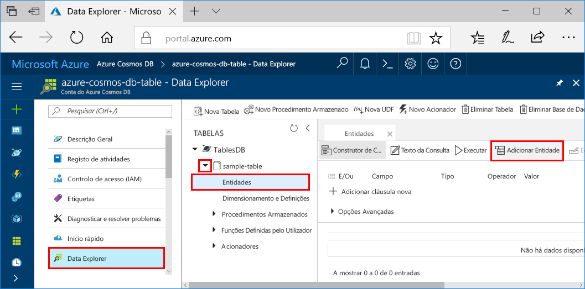
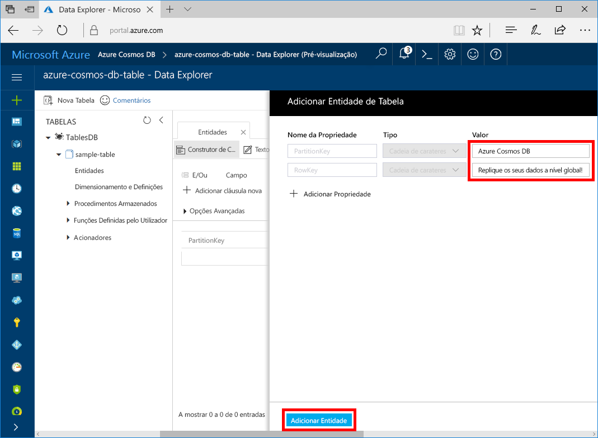

Pode agora utilizar o Data Explorer para adicionar dados à sua tabela nova.

1. Em Data Explorer, expanda **amostra-tabela**, selecione **entidades**e, em seguida, selecione **Adicionar entidade**.

   

2. Agora, adicione dados à caixa valor PartitionKey e à caixa valor RowKey e selecione **Adicionar entidade**.

   
  
    Agora, pode adicionar mais entidades à tabela e editá-las ou consultar os dados no Data Explorer. Também é no Data Explorer que pode dimensionar o débito e adicionar procedimentos armazenados, funções definidas pelo utilizador e acionadores à sua tabela.