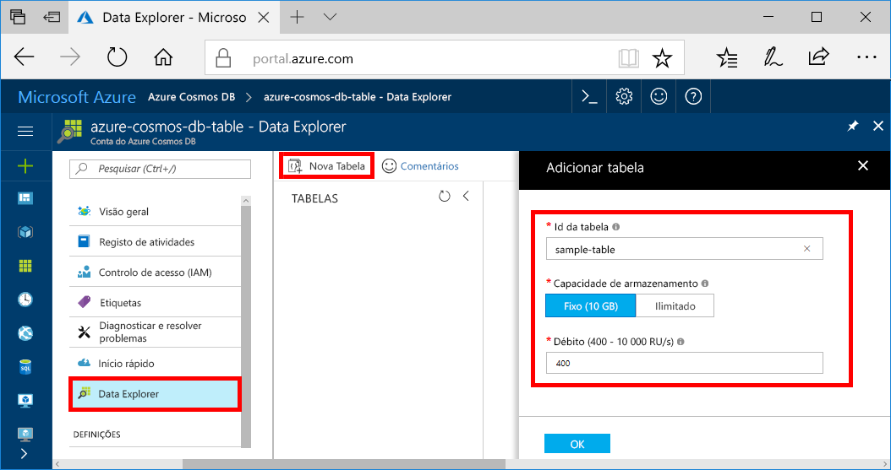

Agora, pode utilizar a ferramenta Data Explorer no portal do Azure para criar uma base de dados e uma tabela. 

1. Selecione **data explorer**  >  **nova tabela**. 
    
    A área **Adicionar Tabela** é apresentada na extremidade direita, pelo que poderá ter de se deslocar para a direita para vê-la.

    

2. Na página **Adicionar Tabela**, introduza as definições para a nova tabela.

    Definição|Valor sugerido|Descrição
    ---|---|---
    ID da tabela|tabela de exemplo|O ID da sua nova tabela. Os nomes das tabelas têm os mesmos requisitos de carateres que os IDs das bases de dados. Os nomes das bases de dados têm de ter entre um e 255 carateres e não podem conter `/ \ # ?` nem espaços à direita.
    Débito|400 RUs|Altere o débito para 400 unidades de pedido por segundo (RU/s). Se pretender reduzir a latência, pode aumentar verticalmente o débito mais tarde.

3. Selecione **OK**.

4. O Data Explorer mostra a base de dados e a tabela novas.

   