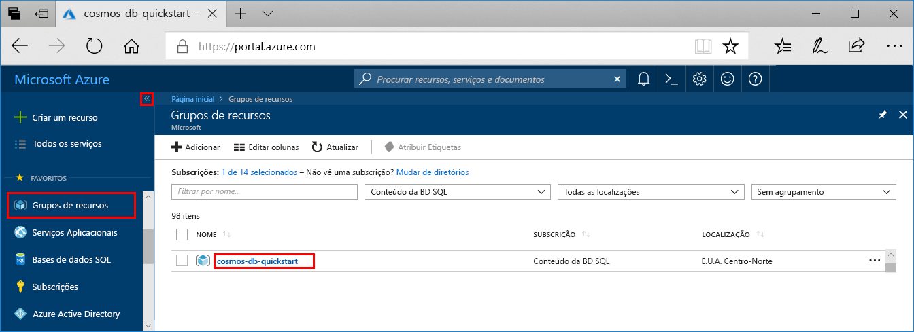
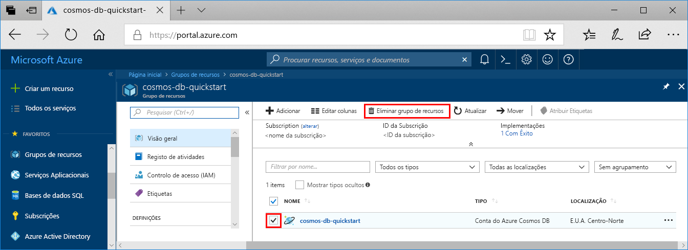

Quando terminar a sua app e a conta DB da Azure Cosmos, pode apagar os recursos Azure que criou para não incorrer em mais encargos. Para eliminar os recursos:

1. Na barra de pesquisa do portal Azure, procure e selecione **grupos de Recursos.**

2. A partir da lista, selecione o grupo de recursos que criou para este arranque rápido.  

   

2. Na página **de visão geral** do grupo de recursos, selecione **Eliminar o grupo de recursos**.

      

3. Na janela seguinte, insira o nome do grupo de recursos para eliminar e, em seguida, **selecione Delete**.

