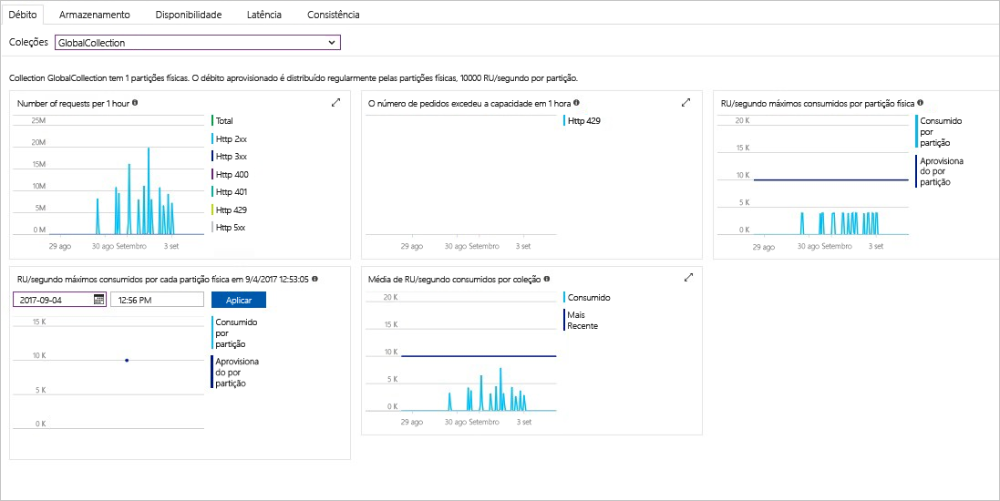

O portal do Azure monitoriza o débito de conta do Cosmos DB, armazenamento, disponibilidade, latência e consistência. Gráficos para métricas associadas com uma [do Azure Cosmos DB ao nível do contrato serviço (SLA)](https://azure.microsoft.com/support/legal/sla/cosmos-db/) Mostrar o valor de SLA em comparação comparado o desempenho real. Este conjunto de métricas faz com que seus SLAs transparentes de monitorização.

Para rever as métricas e SLAs: 

1. Selecione **métricas** no menu de navegação da sua conta do Cosmos DB.
   
2. Selecione como um separador **latência**e selecione um período de tempo à direita. Compare os **real** e **SLA** linhas dos gráficos.
   
   
   
3. Reveja as métricas das outras guias. 

