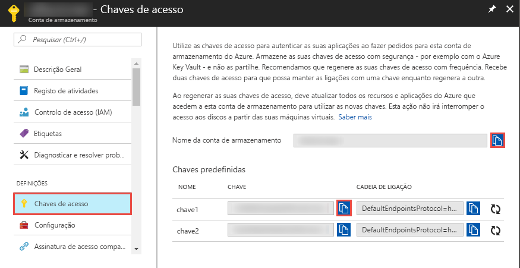

## <a name="prerequisites"></a>Pré-requisitos

### <a name="azure-subscription"></a>Subscrição do Azure
Se não tiver uma subscrição do Azure, crie uma [conta gratuita](https://azure.microsoft.com/free/) antes de começar.

### <a name="azure-roles"></a>Funções do Azure
Para criar instâncias do Data Factory, a conta de utilizador que utiliza para iniciar sessão no Azure tem de ser membro das funções *contribuidor* ou *proprietário* ou *administrador* da subscrição do Azure. Para exibir as permissões que você tem na assinatura, vá para o [portal do Azure](https://portal.azure.com), selecione seu nome de usuário no canto superior direito, selecione **mais opções** (...) e, em seguida, selecione **minhas permissões**. Se tiver acesso a várias subscrições, selecione a subscrição apropriada.

Para criar e gerir recursos subordinados do Data Factory - incluindo conjuntos de dados, serviços ligados, pipelines, acionadores e runtimes de integração - os requisitos seguintes são aplicáveis:

- Para criar e gerir recursos subordinados no portal do Azure, tem de pertencer à função **Contribuidor do Data Factory** ao nível do grupo de recursos ou superior.
- Para criar e gerir recursos subordinados com o PowerShell ou o SDK, a função **contribuidor** ao nível do grupo de recursos ou superior é suficiente.

Para obter instruções de exemplo sobre como adicionar um utilizador a uma função, veja o artigo [Adicionar funções](../articles/billing/billing-add-change-azure-subscription-administrator.md).

Para obter mais informações, veja os artigos seguintes:

- [Função de Contribuidor do Data Factory](../articles/role-based-access-control/built-in-roles.md#data-factory-contributor)
- [Funções e permissões do Azure Data Factory](../articles/data-factory/concepts-roles-permissions.md)

### <a name="azure-storage-account"></a>Conta de armazenamento do Azure
Neste início rápido, vai utilizar uma conta de armazenamento do Azure para fins gerais (especificamente o armazenamento de Blobs) como arquivo de dados de *origem* e de *destino*. Se não tiver uma conta de armazenamento do Azure para fins gerais, veja [Criar uma conta de armazenamento](../articles/storage/common/storage-quickstart-create-account.md) para criar uma. 

#### <a name="get-the-storage-account-name-and-account-key"></a>Obter o nome e a chave da conta de armazenamento
Irá precisar do nome e da chave da sua conta de armazenamento do Azure neste início rápido. O procedimento seguinte disponibiliza os passos para obter o nome e a chave da conta de armazenamento: 

1. Em um navegador da Web, vá para a [portal do Azure](https://portal.azure.com) e entre usando seu nome de usuário e senha do Azure.
2. Selecione **todos os serviços** > **contas de armazenamento**de**armazenamento** > .
3. Na página **contas de armazenamento** , filtre sua conta de armazenamento (se necessário) e, em seguida, selecione sua conta de armazenamento. 
4.  -      *Nabarralateraldapáginanomedaconta>dacontadearmazenamento,váparaorótuloconfiguraçõeseselecionechavesdeacesso.\<* O  *\<nome da conta >*  - **chaves de acesso** é exibido.

   
5. Copie os valores das caixas **Nome da conta de armazenamento** e **key1** para a área de transferência. Cole-os no Bloco de Notas ou noutro editor e guarde-os. Vai utilizá-los mais tarde neste início rápido.   

#### <a name="create-a-blob-container"></a>Criar um contentor de blobs
Nesta secção, vai criar um contentor de blobs com o nome **adftutorial** no armazenamento de Blobs do Azure.

1.  >  -  Na barra lateral da página nome da  *conta>chavesdeacesso,selecioneblobsdevisãogeral.\<*
2. Na barra de  *\<ferramentas nome da conta >*  - página**BLOBs** , selecione **contêiner**.
3. Na caixa de diálogo **Novo contentor**, introduza **adftutorial** para o nome e selecione **OK**. A página  *\<nome da conta >*  - **BLOBs** é atualizada para incluir **adftutorial** na lista de contêineres.

   

#### <a name="add-an-input-folder-and-file-for-the-blob-container"></a>Adicionar uma pasta de entrada e um arquivo para o contêiner de BLOB
Nesta seção, você cria uma pasta chamada **entrada** no contêiner que você acabou de criar e, em seguida, carrega um arquivo de exemplo na pasta de entrada. Antes de começar, abra um editor de texto como o **bloco de notas**e crie um arquivo chamado **EMP. txt** com o seguinte conteúdo:

```emp.txt
John, Doe
Jane, Doe
```

Salve o arquivo na pasta **C:\ADFv2QuickStartPSH** (Se a pasta ainda não existir, crie-a.) Em seguida, retorne ao portal do Azure e siga estas etapas:

1. Na página  *\<nome da conta >*  - **BLOBs** onde você parou, selecione **adftutorial** na lista atualizada de contêineres. (Se você fechou a janela ou passou para outra página, entre na [portal do Azure](https://portal.azure.com) novamente, selecione >  **todos os serviços** > **contas de armazenamento**de armazenamento, selecione sua conta de armazenamento e, em seguida, selecione **BLOBs** **adftutorial.** )  > 
2. Na barra de ferramentas da página de contêiner do **adftutorial** , selecione **carregar**.
3. Na página **carregar blob** , selecione a caixa **arquivos** e, em seguida, navegue até e selecione o arquivo **EMP. txt** .
4. Expanda o título **avançado** . A página agora é exibida como mostrado:

   
5. Na caixa **carregar na pasta** , insira **entrada**.
6. Selecione o botão **Carregar**. Deverá ver o ficheiro **emp.txt** e o estado do carregamento na lista.
7. Selecione o ícone **fechar** (um **X**) para fechar a página **carregar blob** .

Mantenha a página contêiner **adftutorial** aberta. Vai utilizá-la para verificar a saída no final deste início rápido.