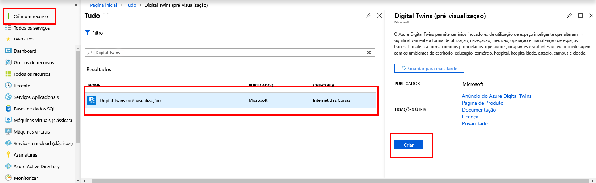
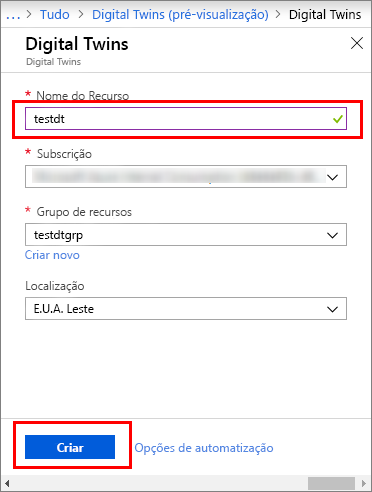
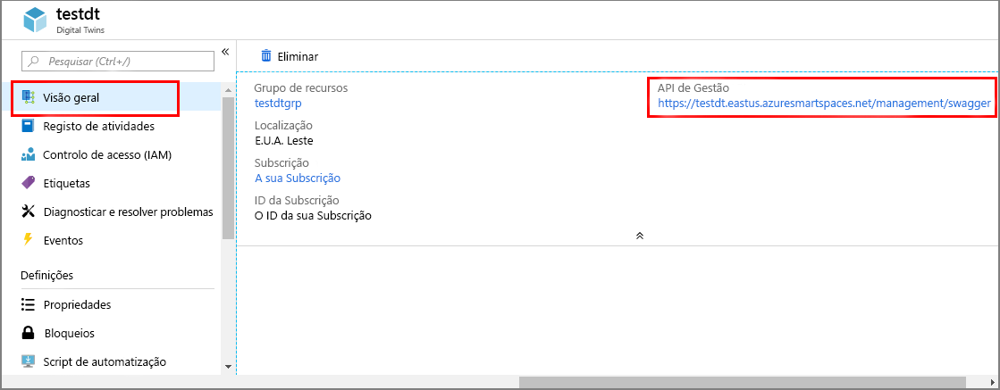

1. Inicie sessão no [portal do Azure](https://portal.azure.com).

1. No painel esquerdo, selecione **criar um recurso**. Pesquise **gêmeos digital**e selecione **digital gêmeos**. Selecione **criar** para iniciar o processo de implantação.

   

1. No painel **Digital Twins**, introduza as seguintes informações:
   * **Nome do recurso**: Crie um nome exclusivo para sua instância de gêmeos digital.
   * **Assinatura**: Escolha a assinatura que você deseja usar para criar essa instância de gêmeos digital. 
   * **Grupo de recursos**: Selecione ou crie um [grupo de recursos](https://docs.microsoft.com/azure/azure-resource-manager/resource-group-overview#resource-groups) para a instância de gêmeos digital.
   * **Local**: Selecione o local mais próximo para seus dispositivos.

     

1. Examine as informações de gêmeos digital e, em seguida, selecione **criar**. Sua instância digital gêmeos pode levar alguns minutos para ser criada. Pode monitorizar o progresso no painel **Notificações**.

1. Abra o painel **Descrição geral** da instância do Digital Twins. Observe o link sob **API de gerenciamento**.

   A URL da **API de gerenciamento** é `https://yourDigitalTwinsName.yourLocation.azuresmartspaces.net/management/swagger`formatada como. Este URL leva-o para a documentação da API REST do Azure Digital Twins que se aplica à sua instância. Leia [Como utilizar o Azure Digital Twins Swagger](../articles/digital-twins/how-to-use-swagger.md) para saber como ler e utilizar esta documentação de API.

    Modifique a URL da **API de gerenciamento** para `https://yourDigitalTwinsName.yourLocation.azuresmartspaces.net/management/api/v1.0/`esse formato. A aplicação irá utilizar o URL modificado como URL base para aceder à sua instância. Copie este URL modificado para um ficheiro temporário. Você precisará dela na próxima seção.

    