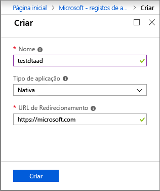
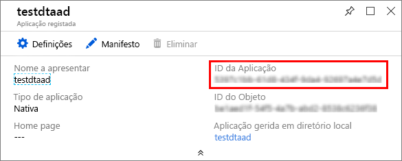
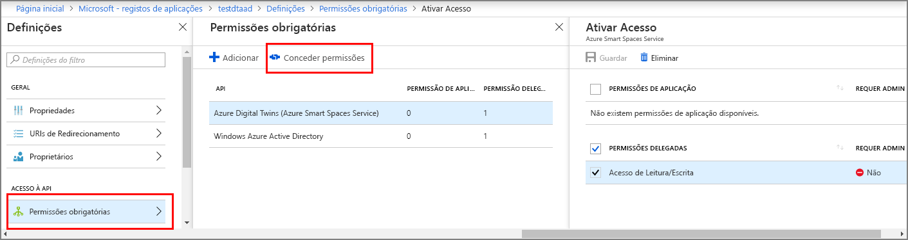

>[!NOTE]
>Esta secção fornece instruções para o registo da [aplicação Azure AD](https://docs.microsoft.com/azure/active-directory/develop/quickstart-register-app).

1. No [portal Azure,](https://portal.azure.com)abra o **Azure Ative Directory** a partir do menu esquerdo expansível e, em seguida, abra o painel de inscrições da **App.** 

    

1. Selecione o botão **+ Novo de registo.**

    

1. Dê um nome amigável para este registo de aplicação na caixa **Nome.** 

    1. Na secção **Redirect URI (opcional),** introduza `https://microsoft.com` na caixa de texto.     

    1. Verifique quais as contas e inquilinos que são apoiados pela sua aplicação Azure Ative Directory.

    1. Selecione **Registar**.

    

1. A lâmina **de autenticação** especifica definições importantes de configuração de autenticação. 

    1. Adicione **URIs redirecionamento** e configure **tokens** de acesso selecionando **+ Adicione uma plataforma**.

    1. Selecione **Sim** para especificar que a aplicação é um **cliente público.**

    1. Verifique quais as contas e inquilinos que são apoiados pela sua aplicação Azure Ative Directory.

    

1. Depois de selecionar a plataforma apropriada, configure os seus **URIs de Redirecionamento** e **Tokens** de Acesso no painel lateral à direita da interface do utilizador.

    1. **As URIs de redirecionamento** devem coincidir com o endereço fornecido pelo pedido de autenticação:

        * Para aplicações hospedadas num ambiente de desenvolvimento local, selecione **cliente Público (mobile & desktop)**. Certifique-se de definir o **cliente público** para **Sim**.
        * Para aplicações de página única hospedadas no Serviço de Aplicações Azure, selecione **Web**.

    1. Determine se um URL de **logout** é apropriado.

    1. Ativar o fluxo implícito da subvenção verificando **fichas** de acesso ou **fichas de identificação**.
                
    

    Clique em **Configurar** **e,** em seguida, guardar .

1.  Abra o painel de **visão geral** da sua app registada e copie os valores das seguintes entidades para um ficheiro temporário. Utilizará estes valores para configurar a sua aplicação de amostra nas seguintes secções.

    - **ID da Aplicação (cliente)**
    - **ID do Diretório (inquilino)**

    

1. Abra o painel de **permissões DaPI** para o registo da sua aplicação. Selecione + Adicione um botão **de permissão.** No painel de **permissões Request API,** selecione as **APIs** que a minha organização usa aba e, em seguida, procure por uma das seguintes:
    
    1. `Azure Digital Twins`. Selecione a API de **Gémeos Digitais Azure.**

        

    1. Alternativamente, procure `Azure Smart Spaces Service`por . Selecione a API **de Serviço de Espaços Inteligentes Azure.**

        

    > [!IMPORTANT]
    > O nome e id da AD Azure AD que aparecerão depende do seu inquilino:
    > * O inquilino de teste e `Azure Digital Twins`as contas dos clientes devem procurar .
    > * Outras contas da `Azure Smart Spaces Service`Microsoft devem procurar .

1. Ou a API aparecerá como **Azure Digital Twins** no mesmo painel de **permissões Request API** uma vez selecionado. Selecione a opção "Ler"drop-down" e, em seguida, selecione a caixa de verificação **Read.Write.** **Read** Selecione o botão **adicionar permissões.**

    

1. Dependendo das configurações da sua organização, poderá ter de tomar medidas adicionais para conceder acesso ao administrador a esta API. Contacte o seu administrador para obter mais informações. Uma vez aprovado o acesso ao administrador, a coluna **Requerida** de Consentimento do Administrador no painel de **permissões DaPI** apresentará as suas permissões. 

    

    Verifique se surgem **gémeos digitais Azure.**
