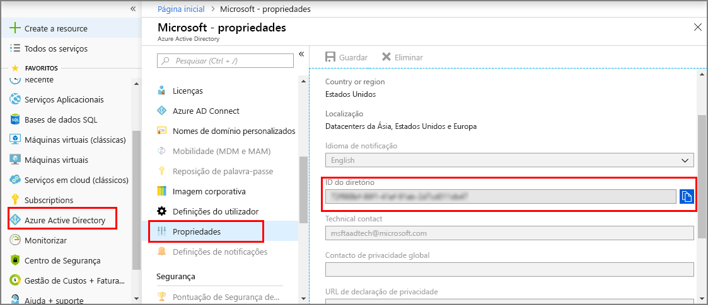

>[!NOTE]
>Lembre-se de que o registo de aplicações legado do AAD que é utilizado aqui será descontinuado em breve. Esta seção será atualizada depois de duplos Digital do Azure é totalmente integrado com o [novo registo de aplicação do AAD](https://docs.microsoft.com/azure/active-directory/develop/quickstart-register-app). Enquanto isso, pode experimentar o novo registo de aplicações do AAD. Tenha em atenção que terá de utilizar [cliente público (mobile & destkop)](https://docs.microsoft.com/azure/active-directory/develop/v2-app-types#mobile-and-native-apps) para o *URI de redirecionamento*. 

1. Na [portal do Azure](https://portal.azure.com), abra **Azure Active Directory** no painel à esquerda e, em seguida, abra a **propriedades** painel. Copie o **ID do diretório** para um ficheiro temporário. Irá utilizar este valor para configurar uma aplicação de exemplo na secção seguinte.

    

1. Na [portal do Azure](https://portal.azure.com), abra **Azure Active Directory** no painel à esquerda e, em seguida, abra a **registos de aplicações (Legado)** painel. Selecione o **novo registo de aplicação** botão.

1. Dê um nome amigável para este registo de aplicações no **nome** caixa. Escolher **tipo de aplicação** como **nativo**, e **URI de redirecionamento** como `https://microsoft.com`. Selecione **Criar**.

    

1.  Abra a aplicação registada e copie o valor do **ID da aplicação** campo num arquivo temporário. Este valor identifica a sua aplicação do Azure Active Directory. Usará o ID da aplicação para configurar o aplicativo de exemplo nas seções a seguir.

    

1. Abra o painel de registo de aplicação. Selecione **configurações** > **permissões obrigatórias**e, em seguida:

   a. Selecione **Add** no canto superior esquerdo para abrir o **adicionar acesso à API** painel.

   b. Selecione **selecionar uma API** e procure **duplos Digital do Azure**. Se a pesquisa não localizar a API, procure **Azure Smart Spaces** como alternativa.

   c. Selecione o **duplos Digital do Azure (serviço do Azure inteligente espaços)** opção e escolha **selecione**.

   d. Escolher **selecionar permissões**. Selecione o **acesso de leitura/escrita** permissões delegadas caixa de verificação e escolha **selecione**.

   e. Selecione **feito** no **adicionar acesso à API** painel.

   f. Na **permissões obrigatórias** painel, selecione a **conceder permissões** botão e aceite a confirmação de que é apresentada. Se a permissão não for concedida para esta API, contacte o administrador.

      

 