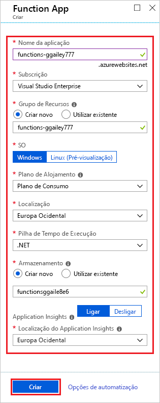
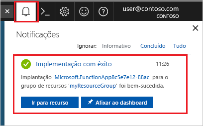

1. Selecione o botão **criar um recurso** encontrado no canto superior esquerdo da portal do Azure e, em seguida, selecione **computação** > **aplicativo de funções**.

    

2. Utilize as definições da aplicação Function App, conforme especificado na tabela abaixo da imagem.

    

    | Definição      | Valor sugerido  | Descrição                                        |
    | ------------ |  ------- | -------------------------------------------------- |
    | **Nome da aplicação** | Nome globalmente exclusivo | Nome que identifica a sua aplicação Function App nova. Os carateres válidos são `a-z`, `0-9` e `-`.  | 
    | **Subscrição** | A sua subscrição | A subscrição sob a qual esta nova aplicação de função é criada. | 
    | **[Grupo de Recursos](../articles/azure-resource-manager/resource-group-overview.md)** |  myResourceGroup | Nome do grupo de recursos novo no qual a aplicação Function App vai ser criada. |
    | **OS** | Windows | As opções de idioma disponíveis dependem do sistema operacional do aplicativo de funções. Por exemplo, o Python requer o Linux. |
    | **[Plano de alojamento](../articles/azure-functions/functions-scale.md)** | Plano de consumo | O plano de alojamento que define a forma como os recursos são alocados à sua aplicação Function App. No **Plano de Consumo** predefinido, os recursos são adicionados dinamicamente, conforme necessário por parte das suas funções. Neste alojamento [sem servidor](https://azure.microsoft.com/overview/serverless-computing/), só paga pelo tempo de execução das suas funções. Quando executa num plano do Serviço de Aplicações, tem de gerir o [dimensionamento da sua aplicação de funções](../articles/azure-functions/functions-scale.md).  |
    | **Location** | Europa Ocidental | Escolha uma [região](https://azure.microsoft.com/regions/) perto de si ou de outros serviços aos quais as suas funções acedem. |
    | **Pilha de tempo de execução** | Linguagem preferencial | Escolha um tempo de execução que suporte a sua linguagem de programação de funções favorita. Selecione **.NET** para funções C# e F#. |
    | **[Armazenamento](../articles/storage/common/storage-quickstart-create-account.md)** |  Nome globalmente exclusivo |  Crie uma conta de armazenamento para ser utilizada pela sua aplicação de funções. Os nomes das contas do Storage devem ter entre 3 e 24 carateres de comprimento e apenas podem conter números e letras minúsculas. Também pode utilizar uma conta existente, a qual tem de cumprir os [requisitos de contas de armazenamento](../articles/azure-functions/functions-scale.md#storage-account-requirements). |
    | **[Application Insights](../articles/azure-functions/functions-monitoring.md)** | Predefinição | Cria um recurso Application Insights do mesmo *nome de aplicativo* na região com suporte mais próximo. Ao expandir essa configuração, você pode alterar o **nome do novo recurso** ou escolher um **local** diferente em uma [Geografia do Azure](https://azure.microsoft.com/global-infrastructure/geographies/) onde você deseja armazenar seus dados. |

3. Selecione **Criar** para aprovisionar e implementar a aplicação de função.

4. Selecione o ícone de Notificação no canto superior direito do portal e procure a mensagem **Implementação concluída com êxito**.

    

5. Selecione **Ir para o recurso** para ver a sua nova aplicação de funções. Você também pode selecionar **fixar no painel**. A fixação torna mais fácil retornar a esse recurso do aplicativo de funções do seu painel.
