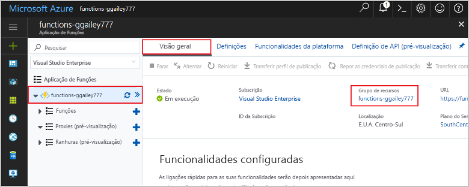

1. No portal do Azure, visite a página **Grupo de recursos**. 

   Para aceder a essa página a partir da página da aplicação de função, selecione o separador **Descrição geral** e, em seguida, selecione a ligação em **Grupo de recursos**.

   

   Para chegar a essa página a partir do painel de **instrumentos,** selecione grupos de recursos e, em seguida, selecione o grupo de recursos que utilizou para este artigo.

2. Na página do **grupo Recursos,** reveja a lista de recursos incluídos e verifique se são eles que pretende eliminar.
 
3. Selecione **Eliminar grupo de recursos** e siga as instruções.

   A eliminação pode demorar alguns minutos. Quando terminar, é apresentada uma notificação durante alguns segundos. Também pode selecionar o ícone de sino na parte superior da página para ver a notificação.