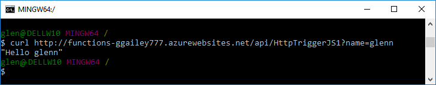
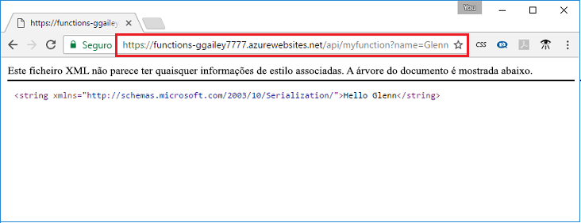

## <a name="test"></a>Testar a função no Azure

Utilize o cURL para testar a função implementada. Com o URL que copiou no passo anterior, anexe a cadeia de consulta `&name=<yourname>` para o URL, como no exemplo seguinte:

```bash
curl https://myfunctionapp.azurewebsites.net/api/httptrigger?code=cCr8sAxfBiow548FBDLS1....&name=<yourname>
```

 

Também pode colar o URL copiado para o endereço do seu navegador da web. Novamente, anexe a cadeia de consulta `&name=<yourname>` para o URL antes de executar o pedido.

  
