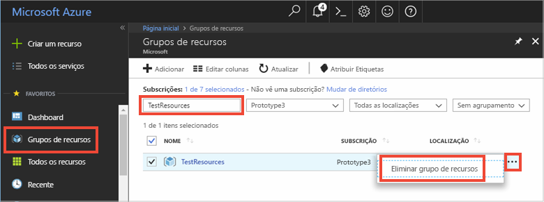

Se avançar para o próximo artigo recomendado, pode manter os recursos que já criou e reutilizá-los.

Caso contrário, pode eliminar os recursos do Azure criados neste artigo para evitar encargos. 

> [!IMPORTANT]
> A eliminação de um grupo de recursos é irreversível. O grupo de recursos e todos os recursos nele contidos são eliminados permanentemente. Confirme que não elimina acidentalmente o grupo de recursos ou recursos errados. Se tiver criado o Hub IoT no interior de um grupo de recursos existente que contenha recursos que pretende manter, elimine apenas o recurso do Hub IoT, em vez de eliminar o grupo de recursos.
>

Para eliminar um grupo de recursos por nome:

1. Inicie sessão no [Portal do Azure](https://portal.azure.com) e selecione **Grupos de recursos**.

2. Na caixa de texto **Filter por nome,** digite o nome do grupo de recursos que contém o seu Hub IoT. 

3. À direita do seu grupo de recursos **...** na lista de resultados, selecione... e depois **elimine o grupo de recursos**.

    

4. É-lhe pedido que confirme a eliminação do grupo de recursos. Escreva novamente o nome do seu grupo de recursos para confirmar e, em seguida, selecione **Delete**. Após alguns instantes, o grupo de recursos e todos os recursos contidos no mesmo são eliminados.