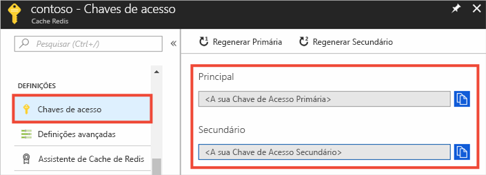
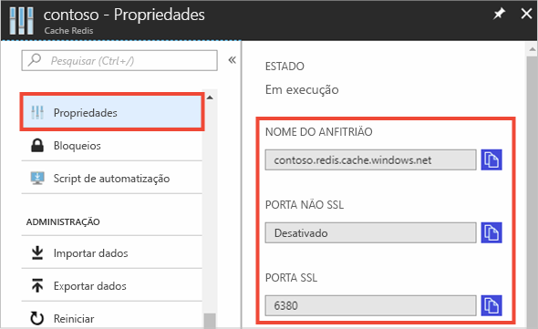

### Recupere o nome do anfitrião, portas e chaves de acesso do portal Azure

Para se conectarem a um Cache Azure para a instância Redis, os clientes da cache precisam do nome de anfitrião, portas e uma chave para a cache. Alguns clientes podem mencionar esses itens com nomes ligeiramente diferentes. Pode obter o nome de anfitrião, portas e chaves do [portal Azure.](https://portal.azure.com)

- Para obter as teclas de acesso, a partir da sua cache navegação à esquerda, selecione **as teclas de acesso**. 
  
  

- Para obter o nome de anfitrião e portas, a partir da sua cache navegação à esquerda, selecione **Propriedades**. O nome do anfitrião é do formulário *\<DNS name> .redis.cache.windows.net*.

  

