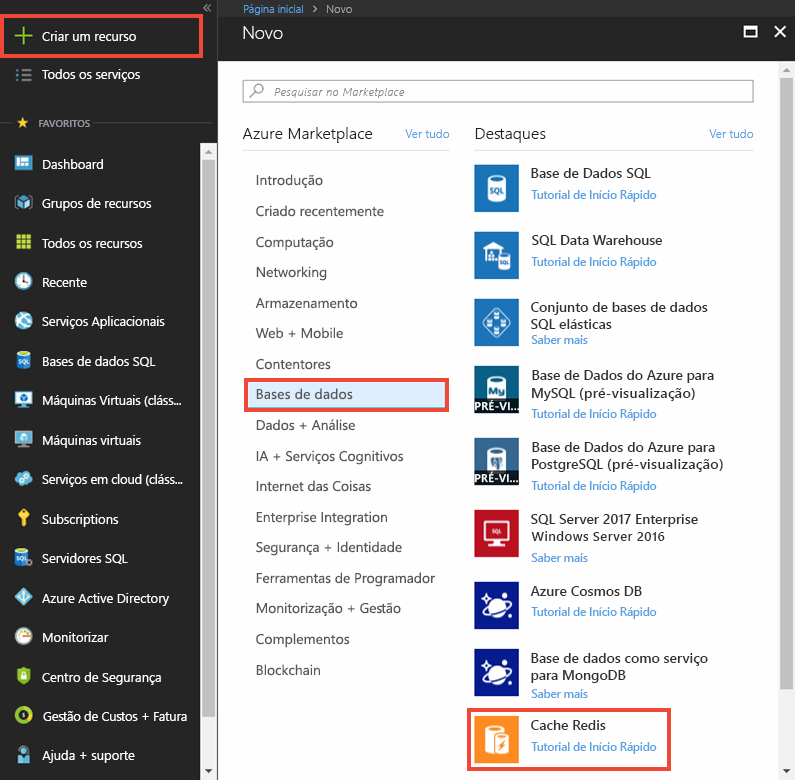
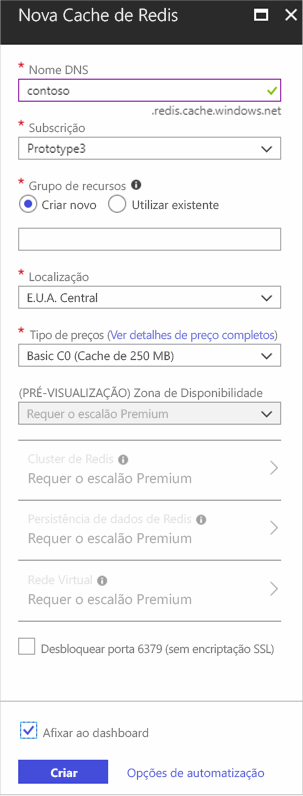
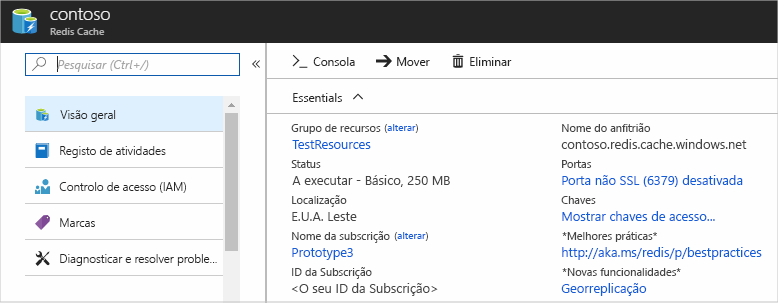

1. Para criar uma cache, inscreva-se no [portal Azure](https://portal.azure.com) e selecione **Criar um recurso.** 
   
   
   
1. Na página **Nova,** selecione **Bases de Dados** e, em seguida, selecione **Azure Cache para Redis**.
   
   
   
1. Na página **New Redis Cache,** configufique as definições para o seu novo cache.
   
   | Definição      | Valor sugerido  | Descrição |
   | ------------ |  ------- | -------------------------------------------------- |
   | **Nome DNS** | Introduza um nome globalmente exclusivo. | O nome da cache deve ser uma cadeia entre 1 e 63 caracteres que contenha apenas números, letras ou hífenes. O nome deve começar e terminar com um número ou letra, e não pode conter hífenes consecutivos. O nome de *anfitrião* do seu caso de cache será * \<DNS name> .redis.cache.windows.net*. | 
   | **Subscrição** | Desça e selecione a sua subscrição. | A subscrição sob a qual criar este novo Azure Cache para a instância Redis. | 
   | **Grupo de recursos** | Desça e selecione um grupo de recursos, ou **selecione Criar novo** e introduza um novo nome de grupo de recursos. | Nome para o grupo de recursos para criar o seu cache e outros recursos. Ao colocar todos os recursos da sua aplicação num único grupo de recursos, pode facilmente geri-los ou eliminá-los em conjunto. | 
   | **Localização** | Desça e selecione um local. | Selecione uma [região](https://azure.microsoft.com/regions/) perto de outros serviços que utilizarão o seu cache. |
   | **Nível de preços** | Desça e selecione um [nível de preços](https://azure.microsoft.com/pricing/details/cache/). |  O escalão de preço determina o tamanho, o desempenho e as funcionalidades que estão disponíveis para a cache. Para mais informações, consulte [Azure Cache para ver visão geral do Redis](../articles/azure-cache-for-redis/cache-overview.md). |
   
1. Selecione **Criar**. 
   
    
   
   Demora um pouco para a cache criar. Pode monitorizar o progresso na cache Azure para a página Redis **Overview.** Quando **o Estado** aparece como **Running,** a cache está pronta a ser utilizada.
   
   

