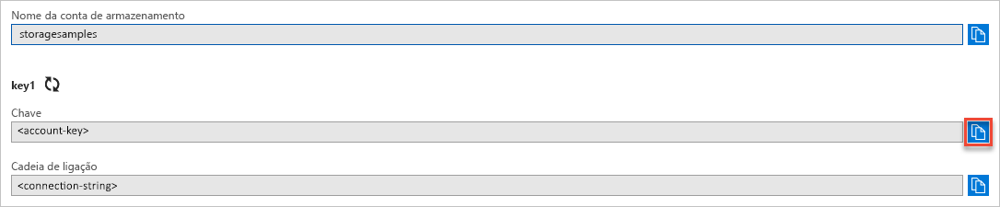

## Copiar as credenciais do Portal do Azure

A aplicação de exemplo tem de autorizar o acesso à sua conta de armazenamento. Forneça suas credenciais de conta de armazenamento para o aplicativo na forma de uma cadeia de conexão. Para ver as credenciais da conta de armazenamento:

1. Inicie sessão no [portal do Azure](https://portal.azure.com).
2. Localize a sua conta de armazenamento.
3. Na secção **Definições** da descrição geral da conta de armazenamento, selecione **Chaves de acesso**. As chaves de acesso da conta e a cadeia de ligação são apresentadas.
4. Tome nota do nome da conta de armazenamento que irá precisar para autorização.   
5. Localize o valor da **chave** em **key1**e selecione **copiar** para copiar a chave da conta.

    
