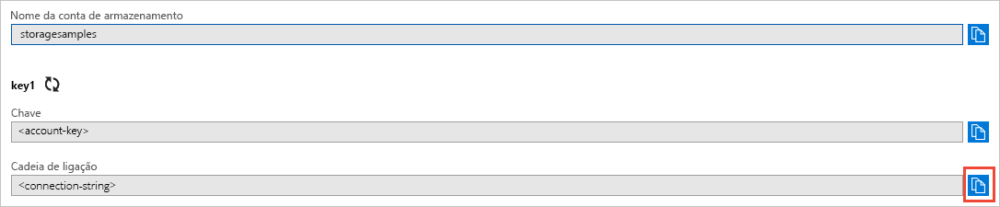

## Copiar as credenciais do Portal do Azure

A aplicação de exemplo tem de autenticar o acesso à sua conta de armazenamento. Para autenticar, adicione as credenciais da conta de armazenamento para a aplicação como uma cadeia de ligação. Veja as credenciais da conta de armazenamento através dos seguintes passos:

1. Navegue para o [portal do Azure](https://portal.azure.com).
2. Localize a sua conta de armazenamento.
3. Na secção **Definições** da descrição geral da conta de armazenamento, selecione **Chaves de acesso**. Aqui, pode ver as chaves de acesso da conta e a cadeia de ligação completa para cada chave.   
4. Encontre o valor da **Cadeia de ligação** em **key1** e selecione o botão **Copiar** para copiar a cadeia de ligação. Irá adicionar o valor da cadeia de ligação para uma variável de ambiente no próximo passo.

    
