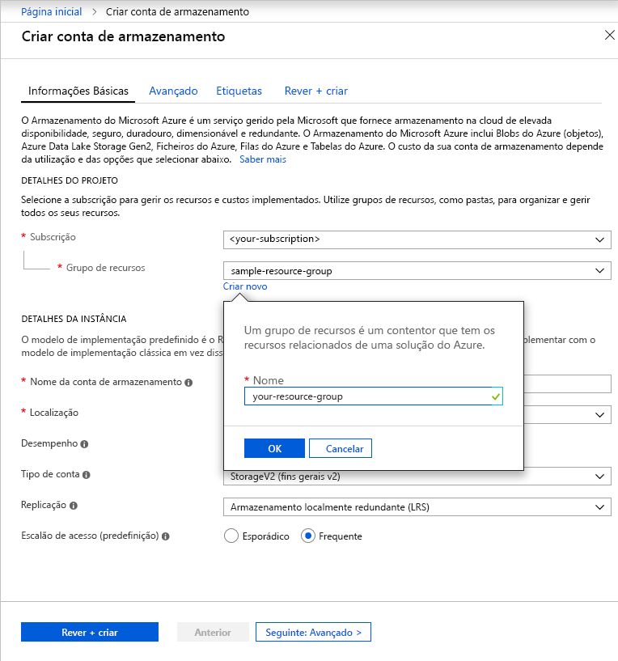

Para criar uma conta de armazenamento para fins gerais v2 no portal do Azure, siga estes passos:

1. No portal do Azure, selecione **Todos os serviços**. Na lista de recursos, escreva **Contas de Armazenamento**. À medida que começa a escrever, a lista filtra com base na sua entrada. Selecione **Contas do Storage**.
1. Na janela **Contas de Armazenamento** que é apresentada, escolha **Adicionar**.
1. Selecione a subscrição na qua pretende criar a conta de armazenamento.
1. No campo **Grupo de recursos**, selecione **Criar novo**. Introduza um nome para o novo grupo de recursos, conforme exemplificado na imagem seguinte.

    

1. A seguir, introduza um nome para a sua conta de armazenamento. O nome que escolher tem de ser exclusivo em todo o Azure. O nome também tem de ter entre 3 e 24 carateres de comprimento e apenas pode incluir números e letras minúsculas.
1. Selecione uma localização para a sua conta de armazenamento ou utilize a localização predefinida.
1. Deixe os outros campos definidos para os respetivos valores predefinidos:

   |Campo  |Value  |
   |---------|---------|
   |Modelo de implementação     |Resource Manager         |
   |Desempenho     |Standard         |
   |Tipo de conta     |StorageV2 (general-purpose v2)         |
   |Replicação     |Armazenamento georredundante com acesso de leitura (RA-GRS)         |
   |Camada de acesso     |Acesso Frequente         |

1. Selecione **Rever + Criar** para rever as definições de conta de armazenamento e criar a conta.
1. Selecione **Criar**.

Para obter mais informações sobre tipos de contas de armazenamento e outras definições de conta de armazenamento, consulte [Descrição geral da conta de armazenamento do Azure](https://docs.microsoft.com/azure/storage/common/storage-account-overview). Para obter mais informações sobre os grupos de recursos, veja [Descrição geral do Azure Resource Manager](https://docs.microsoft.com/azure/azure-resource-manager/resource-group-overview). 
